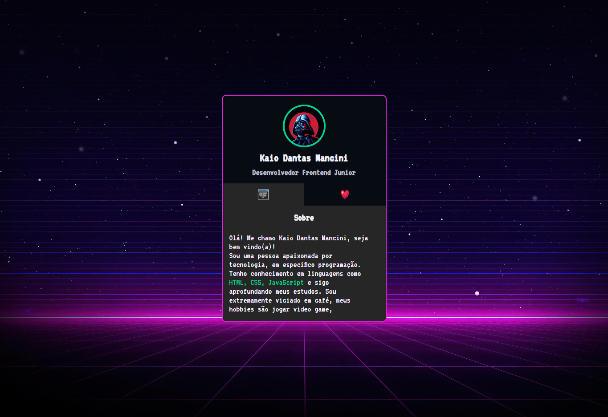
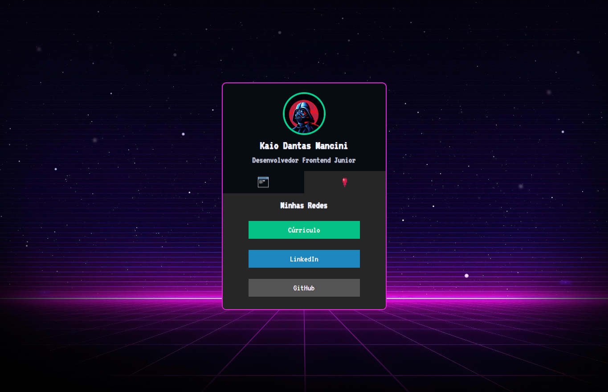

# MapaDev Week

> Um pouco sobre o evento 💻

Projeto construído durante a semana Dev, com o objetivo de praticar alguns conceicos básicos como HTML, CSS e JavaScrpit.

# Tecnologias 🚀
- HTML
- CSS
- JavaScript